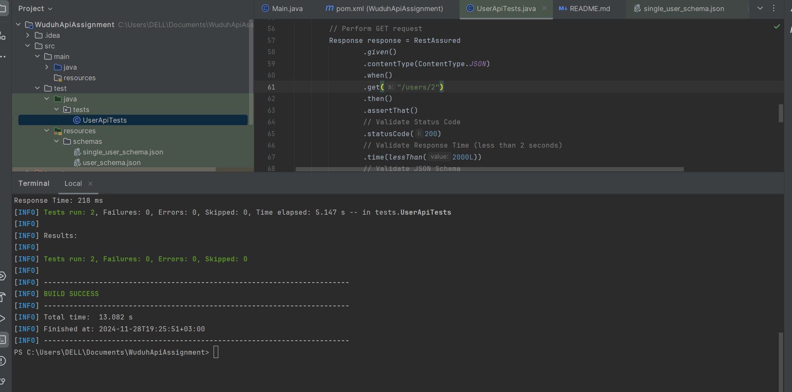

# Rest Assured API Testing Automation

This project automates the testing of the `https://reqres.in/api/users` endpoint using **Rest Assured** and **Java**. It ensures the API adheres to functional and performance requirements, including status code validation, schema validation, response time, and dynamic data checks.

## Project Features

- **Automated Tests**:
    - Validates status code, response time, schema structure, and user details dynamically.
    - Additional test to validate details of the first user.
- **Schema Validation**:
    - Ensures the response matches the pre-defined JSON schema.

## Prerequisites

1. Install **Java 11+**.
2. Install **Maven** for dependency management.
3. Use a modern IDE like IntelliJ IDEA or Eclipse for running and editing the tests.

## ScreenShot
